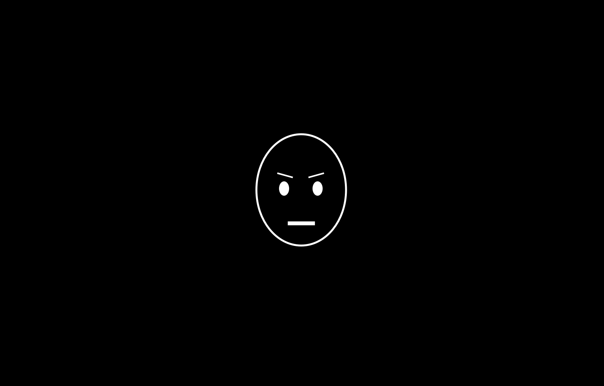

!SLIDE[tpl=title]

## How to run 100 user tests in two days ##

Daniel Sauble, UX designer at Puppet Labs

!SLIDE center

!SLIDE[tpl=section]

# A little background #

!SLIDE

## :waves: ##

!SLIDE center

!SLIDE center

!SLIDE

## My work ##

!SLIDE center

!SLIDE center

!SLIDE center

!SLIDE center

!SLIDE center

!SLIDE center

!SLIDE

## Our research ##

!SLIDE center

!SLIDE center

!SLIDE center

!SLIDE center

!SLIDE[tpl=section]

# What we did #

!SLIDE

## Place ##

!SLIDE

## Booth ##

!SLIDE

## Process ##

!SLIDE

## Equipment ##

!SLIDE

## Tests ##

!SLIDE

## People ##

!SLIDE[tpl=section]

# What we learned #

!SLIDE

## Don&#8217;t ignore your product roadmap ##

!SLIDE

## Don&#8217;t write every study yourself ##

!SLIDE

## Don&#8217;t pick a booth in the busiest hallway ##

!SLIDE

## Don&#8217;t skip on-the-spot analysis ##

!SLIDE

## Don&#8217;t leave your laptops unattended ##

!SLIDE[tpl=section]

# Tips for success #

!SLIDE

## Find a diverse audience ##

!SLIDE

## Train early and often ##

!SLIDE

## Keep things digital ##

!SLIDE

## Consider self-guided tests ##

!SLIDE

## Hold a retrospective ##

!SLIDE

# Q&A #
